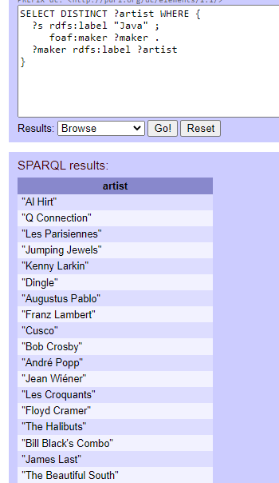

# Semantic Integration Project - HY561

## Nikolaos Gounakis , AM 1254

## 1

In this section we define the list of queries we want to answer , when the projec

List of questions:

* List of all **courses** (undergraduate and postgraduate) in the **area** `"6. Information Systems"` sorted by **year of study** showing the **pre-requisites** of each course

```sparql
DEFINE input:inference <http://localhost:8890/uni>
DEFINE input:same-as "yes"

SELECT DISTINCT ?courses ?yearStudy (GROUP_CONCAT(DISTINCT ?pre_names,',') as ?pre)
WHERE {
?courses rdf:type uni:Course ;
         uni:inArea uni:Information_Systems ;
         uni:yearOfStudy ?yearStudy .
?pre uni:isPrerequisiteOf ?courses ;
     uni:name ?pre_names .
}ORDER BY ?yearStudy
```

Result:


* All **courses** in which the `HY252` is a **prerequisite**

```sparql
DEFINE input:inference <http://localhost:8890/uni>
DEFINE input:same-as "yes"

SELECT DISTINCT ?pre ?pre_names 
WHERE {
uni:CS-252 uni:isPrerequisiteOf ?pre .
?pre uni:name ?pre_names .
}
```

Result:


* What is the total capacity of student seats in CSD **classrooms**?

```sparql
DEFINE input:inference <http://localhost:8890/uni>
DEFINE input:same-as "yes"

SELECT DISTINCT SUM(?cap) as ?total_capacity
WHERE {
?class rdf:type uni:Classroom ;
       uni:capacity ?cap .
}
```

Result:


* How many **lessons** each **programming language** is taught / used in total (in descending order)

```sparql
DEFINE input:inference <http://localhost:8890/uni>
DEFINE input:same-as "yes"

SELECT DISTINCT ?prog COUNT(?prog) as ?count
WHERE
{
?courses uni:useLanguage ?prog
} ORDER BY DESC(?count)
```

Result:


* The **designers** of **programming languages** of **courses** in the area of **information systems**.

```sparql
DEFINE input:inference <http://localhost:8890/uni>
DEFINE input:same-as "yes"

SELECT DISTINCT ?designer ?plang
WHERE
{
?courses rdf:type uni:Course ;
         uni:inArea uni:Information_Systems ;
         uni:useLanguage ?plang .
?plang dbo:designer ?designer .
}
```

Result:


* Artists that have created a song that matches a programming language name that is taught at the 4th year or less

```sparql
DEFINE input:inference <http://localhost:8890/uni>
DEFINE input:same-as "yes"

SELECT DISTINCT ?artist ?prog
WHERE
{
?prog rdf:type uni:ProgrammingLanguage ;
      uni:name ?name .
?course uni:useLanguage ?prog ;
        uni:yearOfStudy ?y .
FILTER(?y <= str(4))
SERVICE <http://dbtune.org/musicbrainz/sparql> 
 {
  ?s rdfs:label ?prog ;
     foaf:maker ?maker .
  ?maker rdfs:label ?artist
 }
}
```

The following result is about "Java". We encountered problems in virtuoso and could not fetch data from a remote service. So we display only the remote end point part. A programming language name matches a song, and we get the artist name.  

Result:



* Percentage of **programming language** coverage that csd provides $\frac{\#csdProgrammingLanguages}{\#totalProgrammingLanguages}$

```sparql
DEFINE input:inference <http://localhost:8890/uni>
DEFINE input:same-as "yes"

SELECT DISTINCT (100*?csd/?prog) as ?coverage ?csd ?prog
WHERE
{
 {
  SELECT DISTINCT COUNT(?csdLang) as ?csd
  WHERE {
  ?course uni:useLanguage ?csdLang
  }
 }
 {
  SELECT DISTINCT COUNT(?progLang) as ?prog
  WHERE {
  ?progLang rdf:type uni:ProgrammingLanguage
 } 
}
}
```

Result:

`8%`


## 2

We take into consideration the ontology [University Ontology](https://www.cs.umd.edu/projects/plus/SHOE/onts/univ1.0.html) from `SHOE` and creating a smaller one containing classes and relationships that can describe the provided data about CSD.

## 3

## 4

## 5

## 6

## 7

## 8

## 9

## 10

## 11

## 12

## 13


Courses
```sparql
PREFIX rdf: <http://www.w3.org/1999/02/22-rdf-syntax-ns#>
PREFIX uni: <http://www.csd.uoc.gr/~hy561/2022/1254/2022/5/UniversityOntology#>

SELECT DISTINCT ?c ?p ?o WHERE {
   {
       ?courses ?p ?o .
       ?courses rdf:type ?type .
       FILTER(?type IN (uni:GraduateCourse, uni:UndergraduateCourse))
   }
   UNION 
   {
       ?o ?p ?courses .
       ?courses rdf:type ?type .
       FILTER(?type IN (uni:GraduateCourse, uni:UndergraduateCourse))
   }
   ?courses uni:name ?c
}
```

## 14
